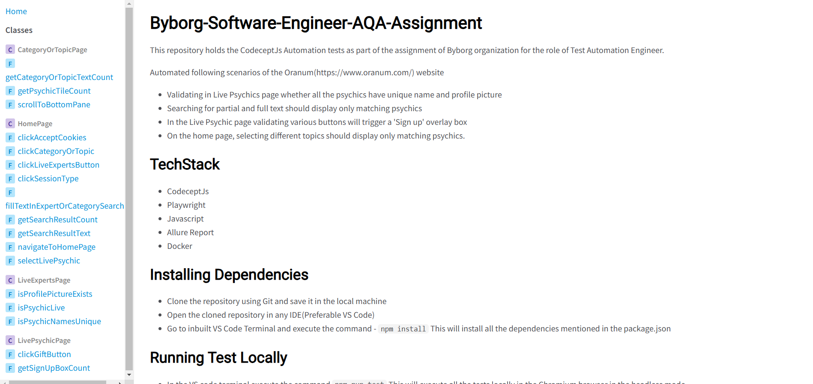

# Byborg-Software-Engineer-AQA-Assignment

This repository holds the CodeceptJs Automation tests as part of the assignment of Byborg organization for the role of Test Automation Engineer.

Automated following scenarios of the Oranum(https://www.oranum.com/) website
 - Validating in Live Psychics page whether all the psychics have unique name and profile picture
 - Searching for partial and full text should display only matching psychics
 - In the Live Psychic page validating various buttons will trigger a 'Sign up' overlay box
 - On the home page, selecting different topics should display only matching psychics.

## TechStack
- CodeceptJs
- Playwright
- Javascript
- Allure Report
- Docker

## Installing Dependencies

 - Clone the repository using Git and save it in the local machine
 - Open the cloned repository in any IDE(Preferable VS Code)
 - Go to inbuilt VS Code Terminal and execute the command - `npm install` This will install all the dependencies mentioned in the package.json

## Running Test Locally

 - In the VS code terminal execute the command `npm run test` This will execute all the tests locally in the Chromium browser in the headless mode.
 - Once the test execution is completed the Allure Report will be generated and the Report will be automatically  opened in the default browser

## Running Test inside Docker

 - As prerequisite need to have the docker installed in the machine.
 - Docker desktop should be running actively
 - In the VS code terminal execute the command `npm run docker` This will first create a new docker image and then will spin up a container with that image and execute all the tests in headless mode.
 - Once the test execution is completed inside the Docker ->  To open the report in the host machine run the command `npm run serve:reports`

## Access Documentation locally
 
 - Project document is available in the `docs/index.html`
 
 

## Access Documentation online

- To access online documentation please check below link
 
    

